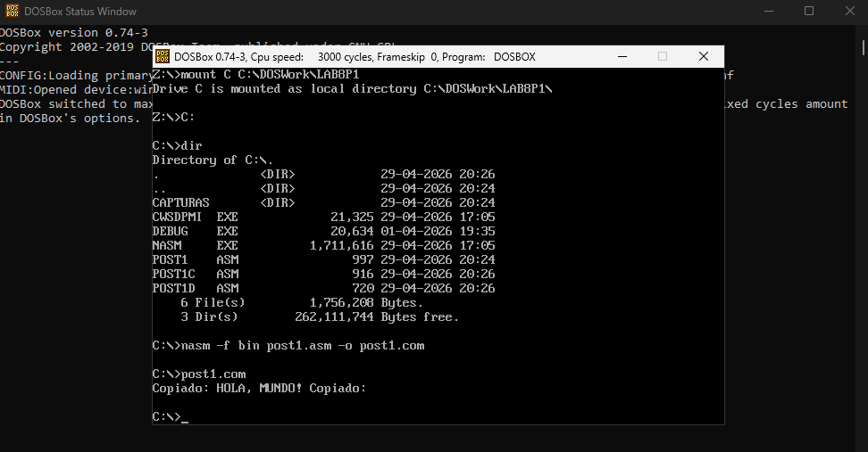
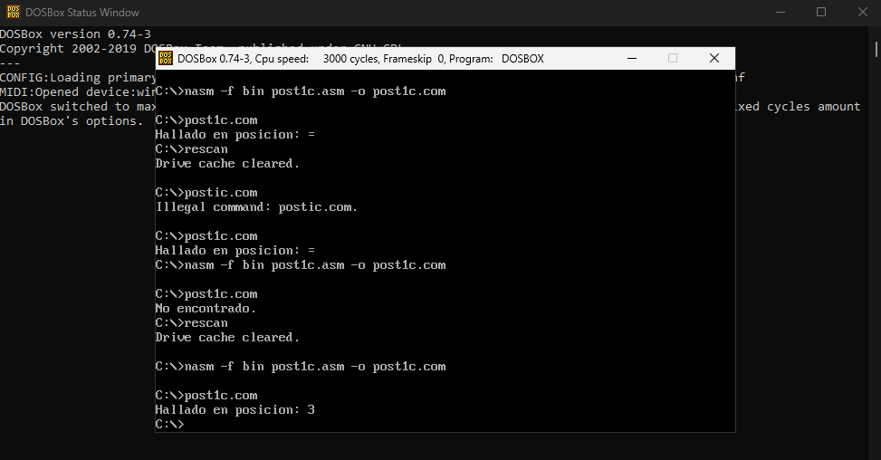
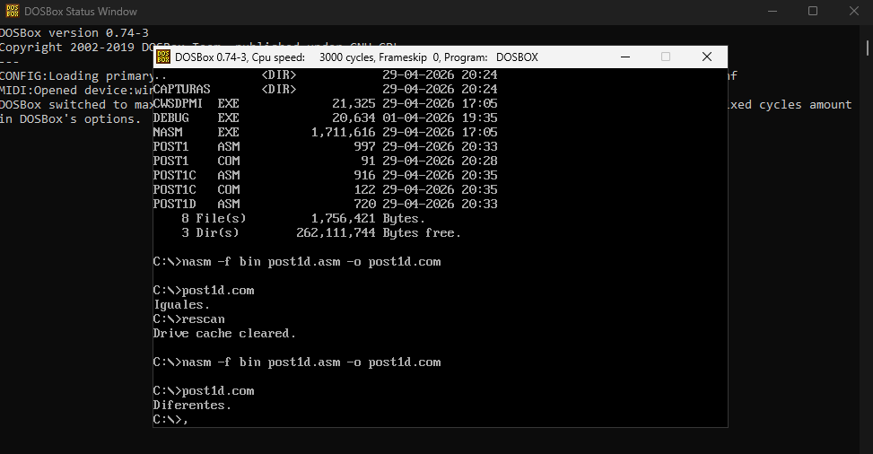

# Arquitectura de Computadores - Unidad 8: Post-Contenido 1

## Datos del Estudiante
* **Nombre:** Obed Ayala
* **Institución:** Universidad Francisco de Paula Santander (UFPS)
* **Programa:** Ingeniería de Sistemas
* **Año:** 2026

## Descripción del Laboratorio
Este laboratorio se enfoca en el procesamiento de bloques de datos en memoria utilizando las instrucciones de cadena de la arquitectura x86. A diferencia de los bucles manuales, estas instrucciones utilizan registros implícitos (**SI**, **DI**, **CX**) y el flag de dirección (**DF**) para operar de forma masiva sobre la memoria.

## Instrucciones de Cadena Implementadas
Se desarrollaron tres programas base para demostrar las funciones de transferencia, búsqueda y comparación:

| Instrucción | Prefijo | Registro Origen | Registro Destino | Función Técnica |
| :--- | :--- | :--- | :--- | :--- |
| **MOVSB/W** | `REP` | `DS:SI` | `ES:DI` | Copia de bytes o palabras entre bloques de memoria. |
| **SCASB** | `REPNE` | `AL` (Valor) | `ES:DI` | Busca una coincidencia entre un registro y la memoria. |
| **CMPSB** | `REPE` | `DS:SI` | `ES:DI` | Compara bit a bit dos regiones de memoria. |

---

## Resultados por Checkpoint

### Checkpoint 1 y 2: Copia Optimizada (`post1.asm`)
Se implementó una rutina de copia que utiliza `MOVSW` para transferir palabras de 16 bits, lo cual es más eficiente que el movimiento byte a byte.
* **Lógica:** Se divide el contador **CX** entre 2 mediante un desplazamiento a la derecha (`SHR`) y se gestiona el byte sobrante (si la longitud es impar) con una instrucción `MOVSB` final.
* **Resultado:** La cadena "HOLA, MUNDO!" se transfiere íntegramente al buffer de destino.

### Checkpoint 3: Búsqueda de Caracteres (`post1c.asm`)
Se utilizó `REPNE SCASB` para localizar la posición de un carácter dentro de una cadena.
* **Cálculo de Posición:** Al finalizar la instrucción, el registro **DI** apunta a la dirección siguiente al carácter hallado. La posición se obtiene restando la dirección base y ajustando el puntero.
* **Nota Técnica:** Para mostrar posiciones mayores a 9 en pantalla, se debe considerar que la suma directa de **30h** (ASCII para '0') producirá símbolos adicionales de la tabla ASCII (como el `=` para la posición 13) si no se implementa una conversión de dos dígitos.

### Checkpoint 4: Comparación de Cadenas (`post1d.asm`)
Se validó la igualdad de bloques de memoria usando `REPE CMPSB`.
* **Caso 1:** Comparación de cadenas idénticas; el flag **ZF** permanece en 1 al terminar el conteo en **CX**.
* **Caso 2:** Comparación de cadenas distintas; la instrucción se detiene en el primer byte diferente, activando **ZF = 0**.

---

## Conclusiones
1. **Eficiencia de Hardware:** Las instrucciones de cadena permiten al procesador realizar tareas comunes de manipulación de memoria con menos líneas de código y mayor velocidad de ejecución.
2. **Importancia del Flag DF:** La inicialización con `CLD` es crítica; de lo contrario, si el flag de dirección estuviera activo, los punteros **SI** y **DI** decrementarían, procesando la memoria en sentido inverso y causando errores en la lógica.
3. **Registros de Segmento:** Es indispensable asegurar que el registro de segmento extra (**ES**) apunte a la misma región que el segmento de datos (**DS**) en programas de tipo `.COM` para que las operaciones de destino funcionen correctamente.
